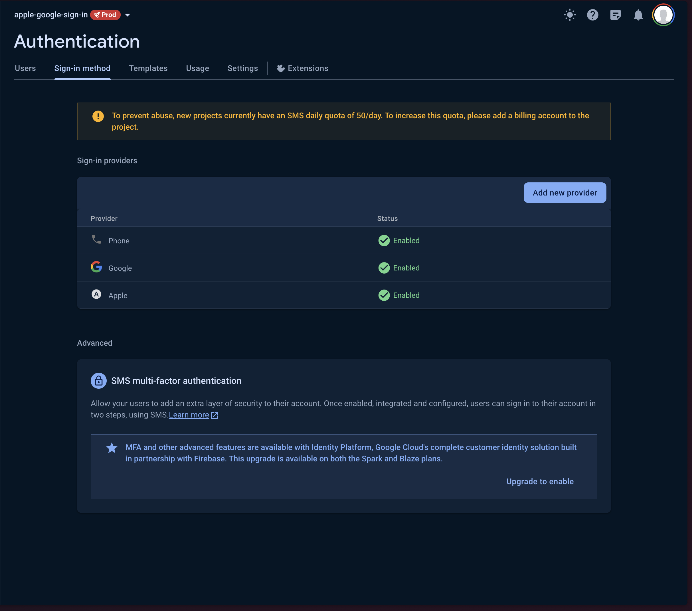
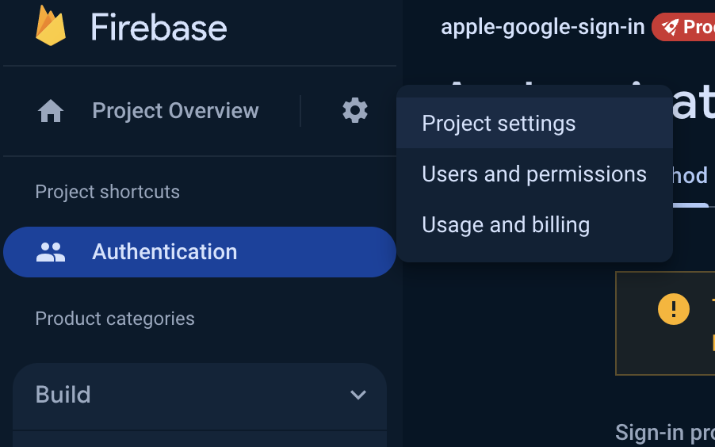

# Authentication

Setting up authentication requires us to create a Firebase project or Supabase project depending on what we want to use. Then, we need to add the appropriate credentials to the backend and the frontend.

## Firebase

### Creating a new Firebase project
1. Go to https://console.firebase.google.com/ and click "Add Project".

1. Then, follow the instructions on Firebase's side to create a new project.

1. Once the project has been set up, click on Authentication in the sidebar.

1. Go to the  Sign-in method tab
 
1. Enable any sign-in methods you want. This starter has support for Phone, Google, and Apple. 
1. Follow the appropriate steps for each provider as linked to on Firebase and the Firebase documentation

Now, we need to set up the `frontend` and `backend` folders to work with this new Firebase project you just set up.

### Backend setup
The backend server needs admin access to your Firebase project to do things like verify the JWT Authorization headers that the client sends back and access user data.

For this, we need to create a service account and then set up the backend to use that service account. The service account credentials look like `backend/firebase-admin-example.json`. This file is referenced in `backend/.env`. 

To get this JSON file, first go to to the Firebase project's settings by clicking the gear icon in the top left corner

Then, go to the Service Accounts tab and click "Generate new private key".

This will generate a `.json` file for you that you can rename to `firebase-admin.json` and move into the `backend` directory.

Now, the setup for the Firebase project in the backend is complete. You can check how the Firebase project is initialized in `backend/src/config/firebase.ts`. 

One way we use the Firebase Admin SDK is to verify the JWT for each `privateProcedure` or private API endpoint we have using a reusable middleware. You can see that being done in `backend/src/trpc/trpc.ts`. For more ways to use the Firebase Admin SDK, please check [their documentation](https://firebase.google.com/docs/admin/setup)

### Frontend Setup
In the frontend code, we must setup the Firebase app so we can properly authorize and authenticate our users. 

The setup is fairly simple, all we need to do is paste the appropiate Firebase credentials in `frontend/.env`.

1. First, go to the Project Overview section in Firebase and click "Add app" and select web as the platform.

2. Call the app whatever you want. In my case, I will go with "Expo app"

1. Since we are using the Firebase JavaScript SDK on the frontend, we are creating a web app. If you prefer to use `react-native-firebase`, you will need to create separate Android and iOS apps. For this starter, we chose to use the Web SDK because it's significantly less bloated and error prone than the native SDKs. Since we are only using Firebase in the frontend for authentication, we don't really need any additional features like Crashalytics, Firebase Messaging, and Analytics that add significant size to the bundle. We have chosen to use Sentry and other tools that better fit the job.
2. Once you have registerd your new web app, you will get the values you need to plug into `frontend/.env`