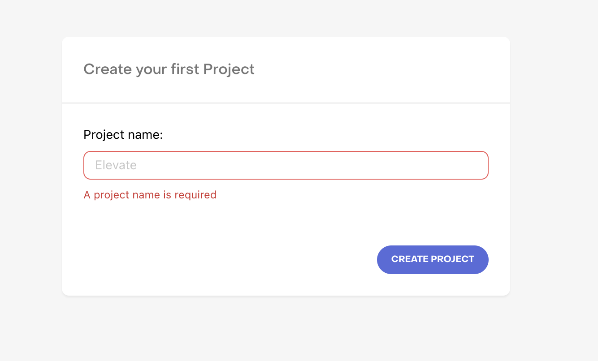
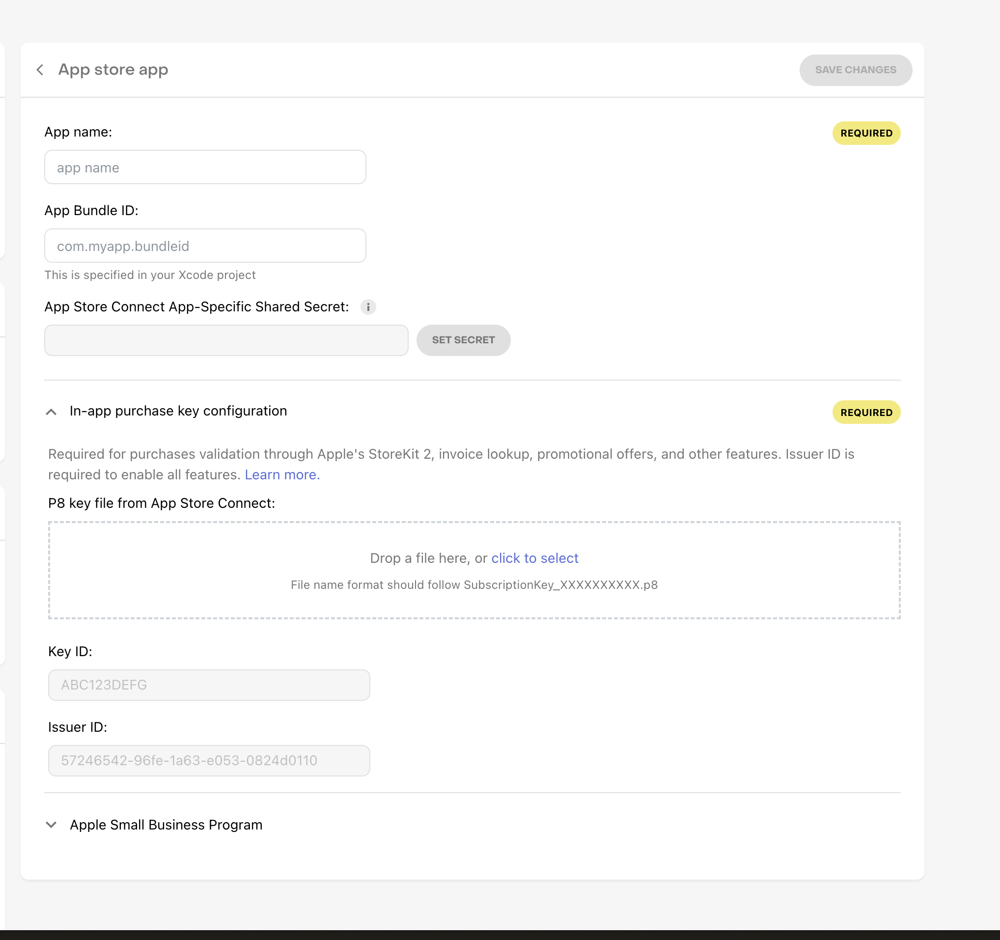
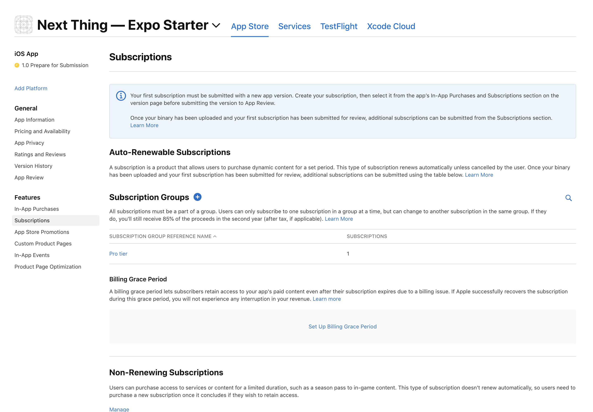
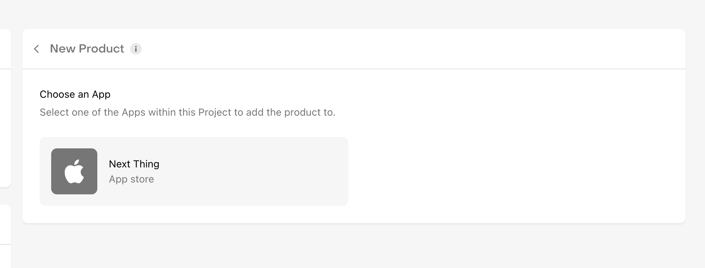
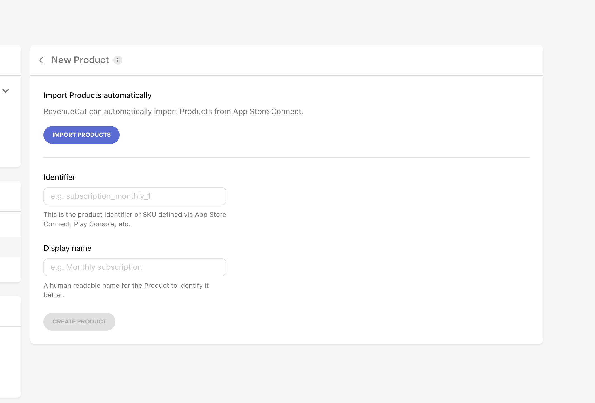
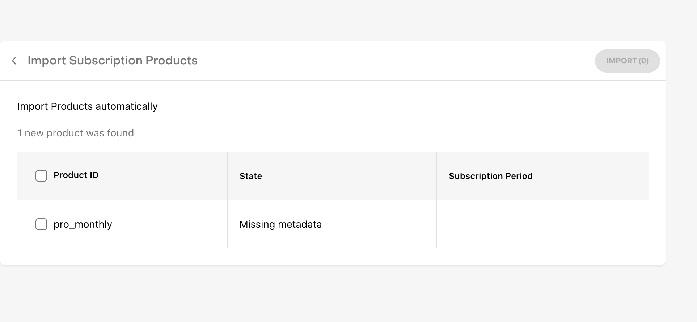
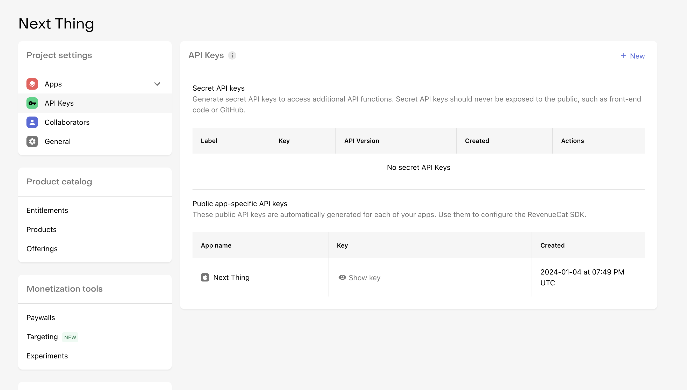

# Payments with RevenueCat

1. Go to [RevenueCat](https://app.revenuecat.com/) and create an account.
2. Create a new project and select the platform you want to use. In this case, we will use iOS.
 
3. Create a new app under the project. For this example we'll use iOS but you can use any platform you want.
 
 
    1. Here we will need to enter an app name, you can put any public facing name here for your app. 
    2. Then we need to enter the app's Bundle ID. This is the same Bundle ID you used when creating the app in `app.json`. 
    3. Then, we need App Store Connect App-Specific Shared Secret. You can find this in App Store Connect under App Information. [Here is a guide on how to find it](https://www.revenuecat.com/docs/itunesconnect-app-specific-shared-secret). 
    4. Since StoreKit 2.0 was released by Apple recently, [we also need to validate in-app purchase keys.](https://community.revenuecat.com/revenuecat-announcements-2/prepare-for-storekit-2-updates-to-historical-data-3786?fid=2&tid=3786). To do this, follow [these instructions](https://www.revenuecat.com/docs/in-app-purchase-key-configuration).
    5. Also follow [these instructions](https://www.revenuecat.com/docs/app-store-connect-api-key-configuration) to set up the App Store Connect API Key so that RevenueCat can fetch the latest in-app purchase data from Apple automatically.
    6. Now the app has been created!
 1. Now on App Store Connect click on your app and "Subscriptions" in the sidebar. Then click on "Add Subscription" and create a new subscription.
 2. You will have to create a subcription "group" that can have multiple types of subscription levels like "yearly", "monthly", "weekly", or any discounted prices. For this example, we will only create a monthly subscription to keep things simple!
 3. Now if you go to RevenueCat you can import the subscription you just created. 
 4. Grab the API key and plug it into the `.env` file 
 5. Make sure to agree to the Paid Apps agreements in Forms & Agreements on the App Store and fill in the necessary detials
 6. 